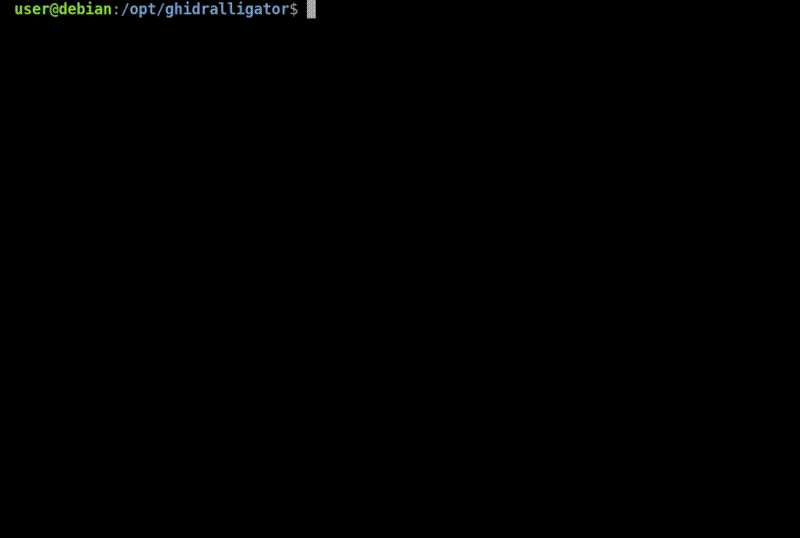

# Ghidralligator

[](https://opensource.org/licenses/Apache-2.0)

Ghidralligator is a C++ multi-architecture [pcode](https://spinsel.dev/assets/2020-06-17-ghidra-brainfuck-processor-1/ghidra_docs/language_spec/html/pcoderef.html) emulator based on the Ghidra libsla, designed for fuzzing with AFL++.

It allows performing emulation-based fuzzing while keeping interesting performances when dealing with binaries running on exotic architectures.

Its extensible nature makes it easy to emulate literally every architecture (as long as you can write the corresponding [Sleigh specification file](https://htmlpreview.github.io/?https://github.com/NationalSecurityAgency/ghidra/blob/master/GhidraDocs/languages/index.html)) to fuzz arbitrary piece of code.

## Installation

Ghidralligator can run on Linux system. It only requires having a GCC version that supports C++ version 17 (tested and working on GCC version 12.2.0).

The Ghidra dependencies are embedded in the project itself under the "./src/" directory.

To properly install Ghidralligator, you must download and compile AFL++ as follows:

1) Clone and install [AFL++](https://github.com/AFLplusplus/AFLplusplus/blob/stable/docs/INSTALL.md)
```
git clone https://github.com/AFLplusplus/AFLplusplus
cd AFLplusplus
make distrib
sudo make install
```

2) Clone and compile Ghidralligator:
```
git clone https://github.com/airbus-cyber/ghidralligator
cd ghidralligator
make ghidralligator
```

3) Retrieve the appropriate .sla file for the architecture you want to emulate.
You can write the .sla file by yourself, or download already-existing ones from the official Ghidra repository ([here](https://github.com/NationalSecurityAgency/ghidra/tree/master/Ghidra/Processors)). You can find a set of default .sla files embedded within the project in the "./specfiles" folder.

## What is Ghidralligator ?
Ghidralligator aims to fill the gap between already existing emulators that require a lot of setup and manual modifications to instrument, run and fuzz the binary, and the "black-box" emulators that are hardly extensible and not suitable for specific and unusual applications.

Its main usage is for vulnerability research in close-source binaries, and especially when targeting embedded-device applications / firmwares running on exotic architectures.

Ghidralligator is the successor of [afl_ghidra_emu](https://github.com/airbus-cyber/afl_ghidra_emu). It greatly improves execution speed and includes useful features like heap memory corruption detection (ASAN). 

A wide variety of memory corruptions can be detected: out-of-bounds read/write operations, use-after-free, double-free, read of uninitialized memory, read/write/exec access violations...

In order to run Ghidralligator the following steps must be done:

  * Setting a configuration file to define the memory mapping layout and the initial state of the program
  * Designing hooks.


## Documentations

* [Ghidralligator Configuration File](docs/configuration_file.md) : Documentation for configuration file writing.
* [Ghidralligator Hooks](docs/user_hook.md) : Documentation for user-hooks file writing.


## Tutorials

To understand how to use Ghidralligator, an [example](examples) of a vulnerable program, compiled on different architectures, has been made. 

You can run [run_examples.sh](examples/run_examples.sh) to see ASAN mechanisms in action.


## Quick start

Ghidralligator comes with several command-line options:
```markdown
usage: ./ghidralligator [OPTION]

  -h 			Print this help and exit.

  -m [replay|fuzz]	Specify an emulation strategy. [REQUIRED]
				In 'replay' mode, the emulator will only launch the program once, exiting after a single loop.
				In 'fuzz' mode, this program must be launched through AFL.

  -c [FILENAME]		Specify the emulator json configuration file to load. [REQUIRED]

  -i [FILENAME]		Specify a test-case file to insert during a replay session. [OPTIONAL]

  -I 			Display info log (/!\ Slow down the emulation). [OPTIONAL]
  -D 			Display debug and info log (/!\ Slow down the emulation). [OPTIONAL]

  -t 			Store log in ./ghidraligator.log file. [OPTIONAL]


```

Usage for a standard emulation:
```bash
$ ./ghidralligator -m replay -c examples/x86/config.json -I -i examples/x86/input/normal_use_case.bin
```


Usage for a standard AFL++ fuzzing session:
```bash
mkdir afl_inputs afl_outputs
echo -n "AAAAAA" > ./afl_inputs/input.bin
$ AFL_SKIP_BIN_CHECK=1 afl-fuzz -D -i ./afl_inputs -o ./afl_outputs/ -- ./ghidralligator -m fuzz -c examples/x86/config.json
```



## Limitations
* Ghidralligator can emulate code thanks to .sla file (Sleigh instruction definition file). SLA files provided by Ghidra community can be partially implemented. In order to get consistent emulation, users may have to complete the related sleigh architecture definition or add some hooks.

* Ghidralligator is based on Ghidra which is not designed to have high performance in emulation purpose. Thus it is not able to compete against classic fuzzer like afl_qemu on standard architectures (x86 linux / windows binaries).

* As the [Ghidra](https://github.com/NationalSecurityAgency/ghidra) project is in constant evolution, it is not recommended to manually update the Ghidralligator dependencies for the future Ghidra versions. The tool was build and tested with the Ghidra 11.0.3 decompiler sources. It may break with future versions, and backward compatibility below the 11.0.3 version is not supported. This is transparent for the user, as the Ghidra dependencies are provided in this repo.

## Licenses
Ghidralligator is released under the [Apache licence version 2.0](https://www.apache.org/licenses/LICENSE-2.0.txt).

Ghidralligator code includes code from the [Ghidra](https://github.com/NationalSecurityAgency/ghidra) project by the [NationalSecurityAgency](https://github.com/NationalSecurityAgency), released under the [Apache licence 2.0](https://github.com/NationalSecurityAgency/ghidra/blob/master/licenses/Apache_License_2.0.txt).

The Ghidralligator configuration file parser includes the [C++ json library](https://github.com/nlohmann/json) by [Niels Lohmann](https://github.com/nlohmann), released under the [MIT licence](https://raw.githubusercontent.com/nlohmann/json/master/LICENSE.MIT).

The Ghidralligator module includes the [xxHash library](https://github.com/Cyan4973/xxHash) by [Yann Collet](https://github.com/Cyan4973), released under the [BSD 2-Clause License](https://github.com/Cyan4973/xxHash/blob/dev/LICENSE).


## Authors
* Flavian Dola - [Airbus](https://www.cyber.airbus.com/) ([Twitter](https://twitter.com/_ceax))
* Guillaume Orlando - [Airbus](https://www.cyber.airbus.com/) ([Twitter](https://twitter.com/HomardBoy))
